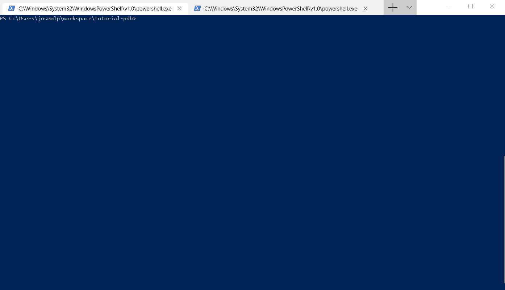

# Depurando desde el templo con herramientas Zen en Python.

En el ciclo de desarrollo que seguimos para construir la aplicación de nuestros sueños, nos encontramos situaciones en las que tenemos que recurrir a la ardua labor de la depuración. Cuando el comportamiento de un componente software comienza a desafiar la lógica seguida en su implementación o cuando se llegan a dar casos límites que en un principio eran imposibles.

En esos momentos es hora de sacar un "nespresso" de la máquina, respirar profundamente e introducirse de lleno en los flujos del programa, con la pericia del mejor detective debemos identificar la parte del código que no se comporta como es debido. 

Ya vemos que el trabajo puede tener cierta dificultad y debemos andarnos con cautela para no confundirnos de malhechor e incluso comprometer flujos que funcionan correctamente.

Es por ello que debemos contar con nuestro mejor arsenal de herramientas propias para Python. 


## Depurador Pdb

Herramienta interna de Python, que permite ejecutar código de forma interactiva, definiendo puntos de parada "breakpoint", ejecutando paso a paso y permitiendo observar como se va comportando la aplicación.

No me extiendo en este punto dado que se explica muy bien en la [documentación oficial](https://docs.python.org/2/library/pdb.html).

En versiones de Python anteriores a 3.7 para activar la depuración pdb necesitábamos escribir 

```python
import pdb; pdb.set_trace()
```

Con versiones Python 3.7+, no necesitamos realizar ninguna importación y tenemos las función "built-in" 
``breakpoint()``

```python
breakpoint()
```

## Depurar código Python en remoto.

Otra de las opciones que tenemos en Python es depurar una rutina que se ejecuta en una máquina diferente al propio host donde nos encontramos trabajando, ya sea por ejemplo un servidor de integración, preproducción o un host virtualizado ya sea mediante un hipervisor o contenedor Docker.

Para este caso contamos con [remote-pdb](https://github.com/ionelmc/python-remote-pdb), que básicamente tiene el mismo comportamiento que pdb, pero exponiendo un sockets TCP para la comunicación de comando y respuestas. 

Para iniciar remote-pdb debemos instalar el paquete "remote-pdb" y ejecutar las siguientes instrucciones:

```bash
pip install remote-pdb
```

```python
from remote_pdb import RemotePdb
RemotePdb('0.0.0.0', 4444).set_trace()
```

y para acceder a la consola **Pdb**, asegurándonos que tenemos visibilidad a la IP **PYTHON_HOST_IP**, ejecutar:

```bash
telnet PYTHON_HOST_IP 4444
```


## Mejoras que añade breakpoint al uso de pdb.

Como vemos el cambio que introduce **breakpoint** a simple vista no es impresionante, seguimos escribiendo una línea de código (quizá un poco más syntax sugar), pero aporta algunas mejoras sensibles.

Poder cambiar el modo de depuración, (local, remota, deshabilitada).

Estableciendo las variables de entorno **PYTHONBREAKPOINT** podemos establecer ```pdb.set_trace``` para depuración en local, ```remote_pdb.set_trace``` para depuración en remoto y ``0`` para deshabilitar depuración y que la instrucción breakpoint() sea transparente.


```bash
PYTHONBREAKPOINT=remote_pdb.set_trace
REMOTE_PDB_HOST=127.0.0.1 
REMOTE_PDB_PORT=4444
```

## Depurando en contenedor Docker de forma remota.

Tenemos la siguiente aplicación python cuya finalidad es transformar números enteros en números romanos, corre en un contenedor Docker y no podemos entrar directamente a su consola interna mediante ``docker exec -it``, por lo tanto necesitamos hacer uso de las herramientas de depuración remota. 

Aquí el código de nuestra aplicación:


```python
#!/usr/bin/env python

def int2roman(number):
    breakpoint()

    coding = zip(
        [1000, 900, 500, 400, 100, 90, 50, 40, 10, 9, 5, 4, 1],
        ["M", "CM", "D", "CD", "C", "XC", "L", "XL", "X", "IX", "V", "IV", "I"]
    )

    if number <= 0 or number >= 4000 or int(number) != number:
        raise ValueError('Input should be an integer between 1 and 3999')

    result = []
    for integer, roman in coding:
        while number >= integer:
            result.append(roman)
            number -= integer
    return ''.join(result)
```

Aquí el script de test de la función:

```python
#!/usr/bin/env python

from int2roman import int2roman

def test_int2roman_three_hundred_twenty_six():
    assert int2roman(326) == 'CCCXXVI'

test_int2roman_three_hundred_twenty_six()
```

La definición completa en Docker-Compose.

```yaml
version: '3'
services:
  python:
    image: python:3.7
    ports:
      - "4444:4444"
    environment:
      - DOCKER=1
      - PYTHONBREAKPOINT=remote_pdb.set_trace
      - REMOTE_PDB_HOST=0.0.0.0
      - REMOTE_PDB_PORT=4444
    command: bash -c "pip install remote-pdb && python /code/test_int2roman.py"
    volumes:
      - .:/code
    stdin_open: true
    tty: true
```    



### Referencias.
- https://docs.python.org/2/library/pdb.html
- https://static.realpython.com/guides/pdb-command-reference.pdf
- https://github.com/ionelmc/python-remote-pdb
